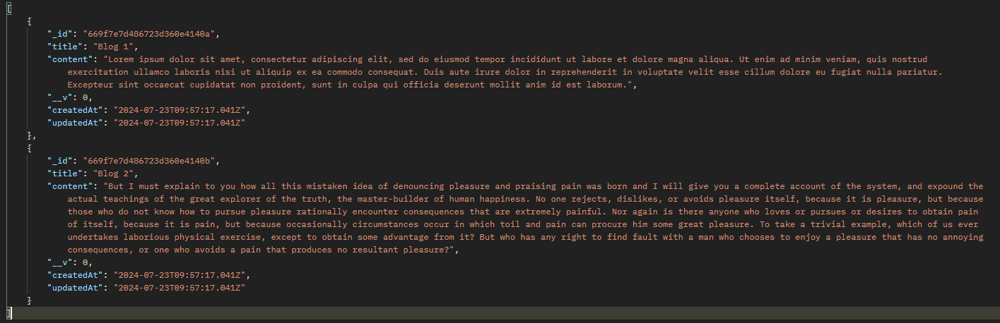
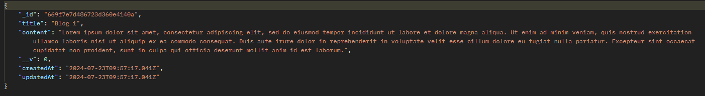
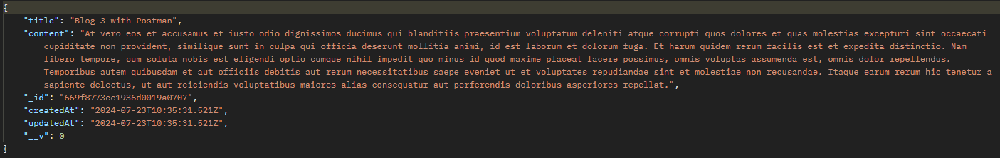
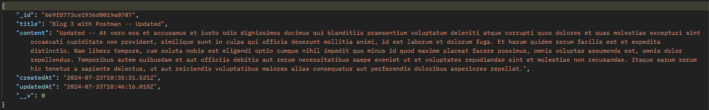
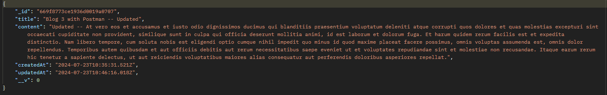
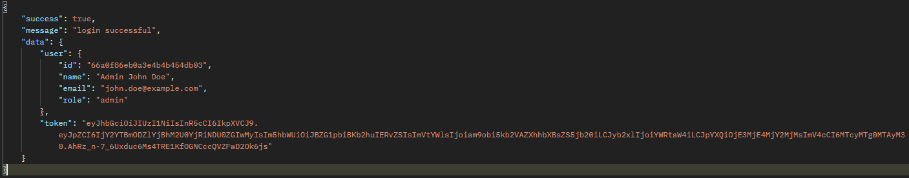

Sure, here is the updated README file including the user login route testing:

---

# Postman API Testing for Blog and User Routes

This guide provides step-by-step instructions for manually testing your blog and user API endpoints using Postman. Follow the steps below to ensure that each endpoint is functioning correctly. Screenshots are included to help illustrate each step.

## Prerequisites

1. **Seed the Database**: Run the seeding script to populate your database with sample blogs and users.
    ```bash
    npm run seed
    ```

## Blog Routes

### 1. Get All Blogs

- **Description**: Retrieve all blogs from the database.
- **Method**: GET
- **Endpoint**: `http://localhost:3000/api/blogs`
- **Steps**:
  1. Open Postman.
  2. Create a new GET request.
  3. Enter the URL: `http://localhost:3000/api/blogs`
  4. Send the request.
  5. Verify the response contains the list of blogs.
  

### 2. Get a Specific Blog

- **Description**: Retrieve a blog by its ID.
- **Method**: GET
- **Endpoint**: `http://localhost:3000/api/blogs/:id`
- **Steps**:
  1. Open Postman.
  2. Create a new GET request.
  3. Enter the URL with a specific blog ID: `http://localhost:3000/api/blogs/669f7e7d486723d360e4140a`
  4. Send the request.
  5. Verify the response contains the details of the specified blog.
  

### 3. Create a Blog

- **Description**: Add a new blog to the database.
- **Method**: POST
- **Endpoint**: `http://localhost:3000/api/blogs/`
- **Request Body**:
    ```json
    {
      "title": "Blog 3 with Postman",
      "content": "At vero eos et accusamus et iusto odio dignissimos ducimus qui blanditiis praesentium voluptatum..."
    }
    ```
- **Steps**:
  1. Open Postman.
  2. Create a new POST request.
  3. Enter the URL: `http://localhost:3000/api/blogs/`
  4. Go to the "Body" tab and select "raw" and "JSON" format.
  5. Insert the request body:
    ```json
    {
      "title": "Blog 3 with Postman",
      "content": "At vero eos et accusamus et iusto odio dignissimos ducimus qui blanditiis praesentium voluptatum..."
    }
    ```
  6. Send the request.
  7. Verify the response confirms the blog was created.
  

### 4. Edit a Blog

- **Description**: Update an existing blog by its ID.
- **Method**: PUT
- **Endpoint**: `http://localhost:3000/api/blogs/:id`
- **Request Body**:
    ```json
    {
      "title": "Blog 3 with Postman -- Updated",
      "content": "Updated -- At vero eos et accusamus et iusto odio dignissimos ducimus qui blanditiis praesentium voluptatum..."
    }
    ```
- **Steps**:
  1. Open Postman.
  2. Create a new PUT request.
  3. Enter the URL with a specific blog ID: `http://localhost:3000/api/blogs/669f7e7d486723d360e4140a`
  4. Go to the "Body" tab and select "raw" and "JSON" format.
  5. Insert the request body:
    ```json
    {
      "title": "Blog 3 with Postman -- Updated",
      "content": "Updated -- At vero eos et accusamus et iusto odio dignissimos ducimus qui blanditiis praesentium voluptatum..."
    }
    ```
  6. Send the request.
  7. Verify the response confirms the blog was updated.
  

### 5. Delete a Blog

- **Description**: Delete a blog by its ID.
- **Method**: DELETE
- **Endpoint**: `http://localhost:3000/api/blogs/:id`
- **Steps**:
  1. Open Postman.
  2. Create a new DELETE request.
  3. Enter the URL with a specific blog ID: `http://localhost:3000/api/blogs/669f7e7d486723d360e4140a`
  4. Send the request.
  5. Verify the response confirms the blog was deleted.
  

## User Routes

### 1. User Login

- **Description**: Log in a user with their email and password.
- **Method**: POST
- **Endpoint**: `http://localhost:3000/api/login`
- **Request Body**:
    ```json
    {
      "email": "john.doe@example.com",
      "password": "password1"
    }
    ```
- **Steps**:
  1. Open Postman.
  2. Create a new POST request.
  3. Enter the URL: `http://localhost:3000/api/login`
  4. Go to the "Body" tab and select "raw" and "JSON" format.
  5. Insert the request body:
    ```json
    {
      "email": "john.doe@example.com",
      "password": "password1"
    }
    ```
  6. Send the request.
  7. Verify the response confirms successful login and returns a token or user details.
  

