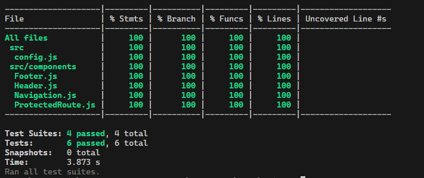

# Frontend Testing for React Applications

## Overview

Frontend testing ensures that your React components render correctly and function as expected. This guide outlines the steps to perform unit testing on your React components using Jest and React Testing Library.

## Dependencies

### Required Packages

1. **Jest:** A testing framework for JavaScript.
2. **React Testing Library:** A testing utility that provides a set of utilities to test React components.
3. **Babel (optional):** If you use ES6+ syntax, you may need Babel to transpile your code.

### Install Dependencies

Run the following commands to install the necessary packages:

```bash
# Install Jest and React Testing Library
npm install --save-dev jest @testing-library/react @testing-library/jest-dom

# If needed, install Babel for JavaScript transpilation
npm install --save-dev @babel/core @babel/preset-env @babel/preset-react babel-jest
```

## Configuration Files

### 1. **Jest Configuration**

Jest requires a configuration file to customize its behavior for your project.

**Steps to Create `jest.config.js`:**

1. **Create the File:**
   - In the root directory of your project, create a file named `jest.config.js`.

2. **Add Basic Configuration:**
   - Add the following configuration to `jest.config.js` to set up Jest for testing React components:

   ```javascript
   module.exports = {
     testEnvironment: 'jsdom',
     transform: {
       '^.+\\.jsx?$': 'babel-jest',
     },
     testMatch: ['**/__tests__/**/*.test.js'],
     collectCoverage: true,
     coverageDirectory: 'coverage',
     coverageReporters: ['json', 'lcov', 'text', 'clover'],
   };
   ```

   - **`testEnvironment: 'jsdom'`**: Ensures Jest runs in a browser-like environment suitable for React components.
   - **`transform`**: Uses Babel to transpile your JavaScript files.
   - **`testMatch`**: Specifies where Jest should look for test files.
   - **`collectCoverage`**: Enables code coverage reporting.
   - **`coverageDirectory`**: Directory where coverage reports will be stored.
   - **`coverageReporters`**: Formats of coverage reports.

### 2. **Babel Configuration**

Babel is needed to transpile modern JavaScript syntax so that Jest can understand it.

**Steps to Create `.babelrc`:**

1. **Create the File:**
   - In the root directory of your project, create a file named `.babelrc`.

2. **Add Babel Configuration:**
   - Add the following configuration to `.babelrc` to support React and modern JavaScript features:

   ```json
   {
     "presets": [
       "@babel/preset-env",
       "@babel/preset-react"
     ]
   }
   ```

   - **`@babel/preset-env`**: Transpiles modern JavaScript features to a version compatible with your environment.
   - **`@babel/preset-react`**: Transpiles JSX and other React-specific syntax.

## Steps

### 1. **Setup Your Testing Environment**

1. **Install Dependencies:**
   - Ensure that Jest, React Testing Library, and any additional tools are installed.

2. **Configure Jest:**
   - Create or update your Jest configuration file (`jest.config.js`) to ensure it is compatible with React and Testing Library.

3. **Configure Babel (if needed):**
   - Create or update your Babel configuration file (`.babelrc`) to ensure Jest can transpile modern JavaScript and JSX.

### 2. **Create Test Files**

1. **Locate or Create the Component Test File:**
   - Place your test files in a dedicated `__tests__` directory or alongside your components with a `.test.js` suffix.

2. **Import Required Libraries:**
   - Import React, Testing Library methods, and your component in the test file.

### 3. **Write Your Tests**

1. **Render the Component:**
   - Use the appropriate method from React Testing Library to render your component within a test.

2. **Add Assertions:**
   - Add assertions to verify that your component displays the correct content or behaves as expected.

3. **Add Console Messages (Optional):**
   - Include `console.log` statements to trace the execution flow and debug issues.

### 4. **Examples of Tests**

- **Header Component:** Verify that the header displays the correct title and content.
- **Navigation Component:** Check that navigation links are correctly rendered based on the user’s login status.
- **ProtectedRoute Component:** Ensure that the component redirects users to the login page if they are not logged in, and renders the protected content if they are logged in.
- **Footer Component:** Confirm that the footer displays the correct contact information and copyright details.


