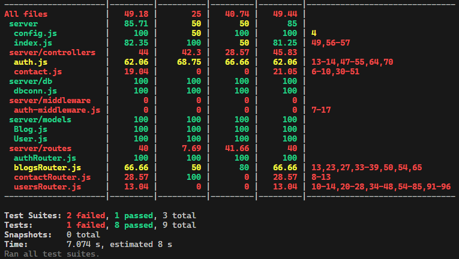

# Unit and Integration Testing with Supertest and Jest

This guide provides step-by-step instructions for setting up and running unit and integration tests for your Express application using Supertest and Jest. Follow the steps below to ensure your API endpoints are properly tested.

## Prerequisites

Before you start, ensure you have the following packages installed:

1. **Jest**: A JavaScript testing framework.
2. **Supertest**: A testing library for HTTP assertions.
3. **Mongoose**: MongoDB object modeling tool.
4. **dotenv**: Loads environment variables from a `.env` file.
5. **babel-jest**: Transpiles ES modules and modern JavaScript for Jest.
6. **@babel/preset-env**: Preset to compile JavaScript.

Install these packages using npm:

```bash
npm install --save-dev jest supertest mongoose dotenv babel-jest @babel/preset-env
```

Ensure your `package.json` is configured to use Jest, and set up Babel if you are using ES modules.

## Authentication Tests

### 1. Set Up Testing Environment

1. **Configure Test Environment**: Use environment variables to point to the test database and other configurations. Set up a test-specific `.env.test` file if needed.

2. **Initialize Test Database**: Connect to your test database before running tests to ensure tests don’t affect your production data.

### 2. Write Authentication Tests

1. **Test User Login**:
   - **Description**: Check that users can log in with valid credentials.
   - **Method**: POST
   - **Endpoint**: `/api/login`
   - **Steps**:
     1. Send a POST request with user credentials.
     2. Verify that the response status is 200 (OK).
     3. Check that the response includes a token.

## Database Connection Tests

### 1. Set Up Mongoose Mocks

1. **Mock Database Connection**: Use mocking tools to simulate database connections for unit tests.

### 2. Write Database Connection Tests

1. **Test Successful Connection**:
   - **Description**: Ensure that the application can connect to the database.
   - **Steps**:
     1. Mock the `mongoose.connect` method to simulate a successful connection.
     2. Verify that the connection method is called with the correct URI.

2. **Test Connection Error Handling**:
   - **Description**: Ensure proper error handling if the connection fails.
   - **Steps**:
     1. Mock the `mongoose.connect` method to simulate a connection error.
     2. Verify that the error is logged and the process exits with a failure status.

## Blog Tests

### 1. Set Up Testing Environment

1. **Connect to Test Database**: Ensure that you are connected to the test database and that the blog collection is empty before running tests.

2. **Clean Up Data**: Clear the blog collection after each test to avoid test interference.

### 2. Write Blog Tests

1. **Test Creating a New Blog**:
   - **Description**: Verify that a new blog can be created successfully.
   - **Method**: POST
   - **Endpoint**: `/api/blogs`
   - **Steps**:
     1. Send a POST request with blog details.
     2. Verify that the response status is 201 (Created).
     3. Check that the response contains the blog details.

2. **Test Getting All Blogs**:
   - **Description**: Check that all blogs can be retrieved.
   - **Method**: GET
   - **Endpoint**: `/api/blogs`
   - **Steps**:
     1. Send a GET request to fetch all blogs.
     2. Verify that the response status is 200 (OK).
     3. Ensure the response includes all blogs.

3. **Test Getting a Single Blog by ID**:
   - **Description**: Ensure that a specific blog can be retrieved by its ID.
   - **Method**: GET
   - **Endpoint**: `/api/blogs/:id`
   - **Steps**:
     1. Send a GET request with a specific blog ID.
     2. Verify that the response status is 200 (OK).
     3. Check that the response includes the blog details.

4. **Test Updating a Blog**:
   - **Description**: Verify that a blog can be updated successfully.
   - **Method**: PUT
   - **Endpoint**: `/api/blogs/:id`
   - **Steps**:
     1. Send a PUT request with updated blog details.
     2. Verify that the response status is 200 (OK).
     3. Check that the response contains the updated blog details.

5. **Test Deleting a Blog**:
   - **Description**: Ensure that a blog can be deleted successfully.
   - **Method**: DELETE
   - **Endpoint**: `/api/blogs/:id`
   - **Steps**:
     1. Send a DELETE request with a specific blog ID.
     2. Verify that the response status is 200 (OK).
     3. Check that the response contains the deleted blog details.


